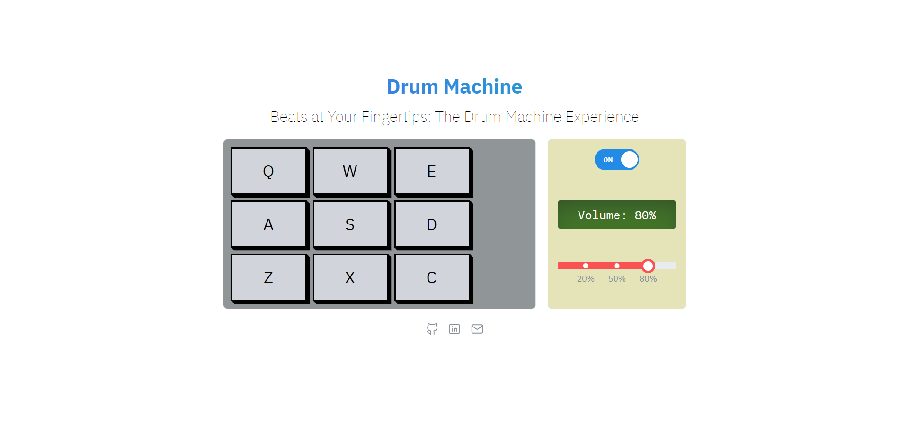

# Drum Machine Simulator

Welcome to the Drum Machine Simulator project! This is a web application that simulates a drum machine, allowing users to play with beats.

## Technologies

- [Vite](https://vitejs.dev/): A fast development build tool that serves your code via native ES modules.
- [React.js](https://reactjs.org/): A popular JavaScript library for building user interfaces.
- [TypeScript](https://www.typescriptlang.org/): A statically typed superset of JavaScript that enhances code quality and developer productivity.
- [Tabler Icons for React](https://github.com/tabler/tabler-icons): A set of over 800 free MIT-licensed high-quality SVG icons for you to use in your web projects.
- [Mantine](https://mantine.dev/): A modern React component library that provides a set of high-quality components and hooks for building functional and attractive user interfaces.

## Usage

- **Select Drum Sounds**: Choose drum sounds by clicking buttons or using keyboard shortcuts. For instance, click "Kick Drum" or press 'Q' for the kick drum sound.
- **Adjust Volume**: Customize the volume to your liking.
- **Power On/Off**: Easily turn the machine on or off.
